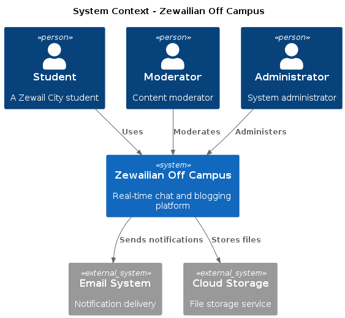
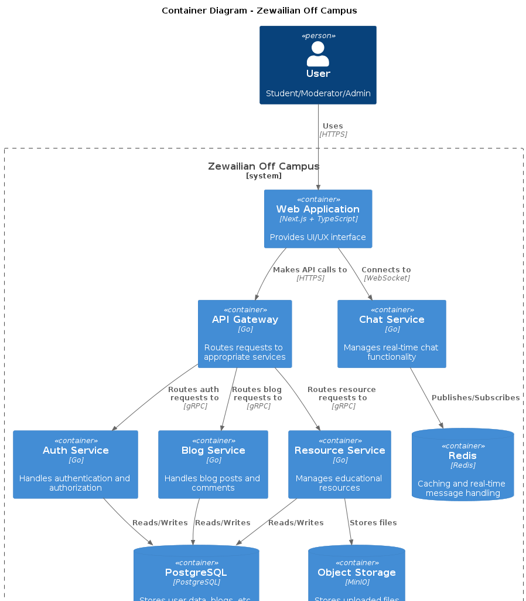
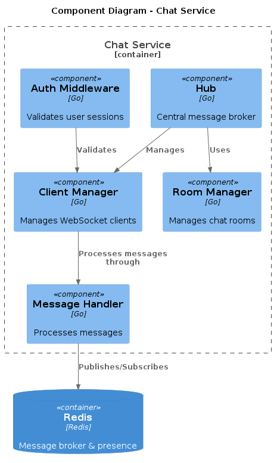

# Software Requirements Specification

for  
**Zewailian Off Campus**  
Version 1.0  

## Prepared by  

- Nour Eldin Mohamed (202201310)  
- Ahmed Gamal (202201638)  
- Sara Mostafa (202201305)  
- Basmala Alaa (202201138)  

## Zewail City  

---  

# Table of Contents  

1. [Introduction](#1-introduction)  
   1.1 [Purpose](#11-purpose)  
   1.2 [Intended Audience](#12-intended-audience)  
   1.3 [Project Scope](#13-project-scope)  

2. [Overall Description](#2-overall-description)  
   2.1 [Product Features](#21-product-features-functional-and-non-functional-requirements)  
   2.2 [User Classes and Characteristics](#22-user-classes-and-characteristics)  
   2.3 [Design and Implementation Constraints](#23-design-and-implementation-constraints)  

3. [System Models](#3-system-models)  
   3.1 [Use Case Models](#31-use-case-models)  
   3.2 [User Stories](#32-user-stories)  

4. [System Diagrams](#4-system-diagrams)  
   4.1 [Context Diagram](#41-context-diagram)  
   4.2 [Container Diagram](#42-container-diagram)  
   4.3 [Component Diagram](#43-component-diagram)  

5. [System ADRs](#5-system-adrs)  
6. [Resilience Strategies](#6-resilience-strategies)  

---  

## 1. Introduction  

### 1.1 Purpose  

Zewailian Off Campus is a real-time chat and blogging platform designed specifically for Zewail City for Science and Technology students. The platform enables students to create chat rooms, share achievements, upload educational materials, make announcements, and participate in Q&A discussions. The primary purpose is to foster communication and collaboration among students outside the campus environment.  

### 1.2 Intended Audience  

The primary audiences of this document are developers who will be implementing the software and stakeholders who will be reviewing the functionalities of the platform.  

### 1.3 Project Scope  

The project encompasses a web-based platform with real-time chat functionality, blogging capabilities, and resource sharing features. It includes user authentication, role-based access control, and a microservices architecture for scalability and maintainability.  

---  

## 2. Overall Description  

### 2.1 Product Features (Functional and Non-functional Requirements)  

#### Functional Requirements:  

1. **User Authentication**: Users should be able to sign in using OAuth2 with Google.  
2. **Real-time Chat**: Users should be able to create and join chat rooms with real-time messaging.  
3. **Blogging**: Users should be able to create, read, update, and delete blog posts.  
4. **Resource Sharing**: Users should be able to upload and download educational materials.  
5. **Announcements**: Users should be able to make and view announcements.  
6. **Q&A Discussions**: Users should be able to participate in Q&A discussions.  
7. **User Presence**: The system should display user presence indicators in chat rooms.  
8. **Message History**: The system should persist and display message history.  
9. **Role-based Access Control**: The system should enforce role-based permissions for different actions.  
10. **API Gateway**: The system should route requests to appropriate backend services via an API Gateway.  

#### Non-functional Requirements:  

1. **Performance**: The system shall process requests and load pages within a maximum of 3 seconds.  
2. **Scalability**: The system shall handle up to 100 concurrent users at peak times.  
3. **Availability**: The system shall maintain 99.9% uptime.  
4. **Security**: The system shall authenticate and authorize users using OAuth2 and JWT.  
5. **Maintainability**: The codebase shall be modular, applying single responsibility principles to allow for extendable modifications and updates.  

---  

### 2.2 User Classes and Characteristics  

- **Students**: Primary users who will create and join chat rooms, share resources, and participate in discussions.  
- **Faculty**: Users with elevated permissions who can moderate content and make announcements.  
- **Administrators**: Users with full access to system settings and user management.  

### 2.3 Design and Implementation Constraints  

- The system will be developed using a microservices architecture with Go for the backend and Next.js for the frontend.  
- PostgreSQL will be used as the primary database, with Redis for caching and real-time features.  
- Docker will be used for containerization and deployment.  

---  

## 3. System Models  

### 3.1 Use Case Models  

#### Use Case ID: UC-01  

**Use Case Name:** User Authentication  
**Actors:**  
- Main Actor: User  
- Secondary Actor: System  

**Preconditions:**  
- User has an internet connection and is on the login page.  

**Main Flow:**  
1. User clicks on the "Sign in with Google" button.  
2. System redirects the user to Google's OAuth2 authentication page.  
3. User enters their Google credentials and grants permission.  
4. System validates the credentials and issues a JWT.  
5. User is redirected back to the platform and granted access.  

**Alternative Flow:**  
- 4a. If authentication fails, the system displays an error message.  

**Postconditions:**  
- User is authenticated and can access the platform.  

---  

#### Use Case ID: UC-02  

**Use Case Name:** Create Chat Room  
**Actors:**  
- Main Actor: User  
- Secondary Actor: System  

**Preconditions:**  
- User is authenticated and on the chat page.  

**Main Flow:**  
1. User clicks on the "Create Chat Room" button.  
2. User enters a name and description for the chat room.  
3. User clicks "Create".  
4. System validates the input and creates the chat room.  
5. System adds the user to the chat room and displays it in the chat list.  

**Alternative Flow:**  
- 4a. If the name is invalid, the system displays an error message.  

**Postconditions:**  
- A new chat room is created, and the user is added to it.  

---  

#### Use Case ID: UC-03  

**Use Case Name:** Upload Educational Material  
**Actors:**  
- Main Actor: User  
- Secondary Actor: System  

**Preconditions:**  
- User is authenticated and on the resources page.  

**Main Flow:**  
1. User clicks on the "Upload" button.  
2. User selects a file from their device.  
3. User enters a title and description for the file.  
4. User clicks "Upload".  
5. System validates the file and uploads it to the server.  
6. System displays the file in the resources list.  

**Alternative Flow:**  
- 5a. If the file is too large, the system displays an error message.  

**Postconditions:**  
- The file is uploaded and available for download by other users.  

---  

### 3.2 User Stories  

#### 1. Student User Stories:  

1.1. As a student, I want to sign in using my Google account so that I can access the platform.  
1.2. As a student, I want to create a chat room so that I can discuss topics with my peers.  
1.3. As a student, I want to upload educational materials so that I can share resources with others.  
1.4. As a student, I want to participate in Q&A discussions so that I can get help with my studies.  

#### 2. Faculty User Stories:  

2.1. As a faculty member, I want to make announcements so that I can inform students about important updates.  
2.2. As a faculty member, I want to moderate chat rooms so that I can ensure appropriate content.  

#### 3. Administrator User Stories:  

3.1. As an administrator, I want to manage user roles so that I can control access to platform features.  

---  

## 4. System Diagrams  

### 4.1 Context Diagram  

### 4.2 Container Diagram  

### 4.3 Component Diagram  

 

---  

## 5. System ADRs  

### ADR 001: Microservices Architecture  

**Context**: The platform needs to handle multiple distinct functionalities (chat, blogging, resource sharing) with different scaling requirements and development velocities.  

**Decision**: Adopt a microservices architecture using Go for the backend services.  

**Consequences**:  
- **Pros**: Independent scaling of services, technology flexibility, isolated failure domains.  
- **Cons**: Increased operational complexity, need for service orchestration.  

---  

### ADR 002: WebSocket for Real-time Communication  

**Context**: The platform requires real-time chat functionality with minimal latency and efficient server resource usage.  

**Decision**: Use WebSocket protocol for real-time communication, implemented using Go's Gorilla WebSocket library.  

**Consequences**:  
- **Pros**: Full-duplex communication, lower latency compared to HTTP polling.  
- **Cons**: Need for connection management, potential challenges with load balancers.  

---  

### ADR 003: PostgreSQL as Primary Database  

**Context**: The system needs a reliable, ACID-compliant database that can handle complex queries and relationships.  

**Decision**: Use PostgreSQL as the primary database with Redis for caching and real-time features.  

**Consequences**:  
- **Pros**: Strong ACID compliance, rich feature set, excellent community support.  
- **Cons**: Requires more operational expertise, vertical scaling limitations.  

---  

### ADR 004: API Gateway Implementation  

**Context**: In a microservices architecture, managing communication between frontend clients and multiple backend services can be complex.  

**Decision**: Implement an API Gateway using KrakenD to serve as the single entry point for all client requests.  

**Consequences**:  
- **Pros**: Centralized control over traffic and security, easier monitoring and logging.  
- **Cons**: Slightly increased complexity in gateway configuration.  

---  

### ADR 005: OAuth2 Authentication  

**Context**: We needed a secure, scalable, and user-friendly authentication mechanism for students and faculty.  

**Decision**: Implement OAuth 2.0 with Google as the authentication provider.  

**Consequences**:  
- **Pros**: Simplified login experience, no password storage or management.  
- **Cons**: Dependency on an external identity provider (Google).  

---  

### ADR 006: Redis Caching Layer  

**Context**: To improve performance and reduce database load, we needed a fast and efficient caching mechanism.  

**Decision**: Integrate Redis as a caching layer and Pub/Sub mechanism.  

**Consequences**:  
- **Pros**: Significantly improved response times and scalability.  
- **Cons**: Additional infrastructure and setup overhead.  

---  

### ADR 007: OpenSearch for Logging and Monitoring  

**Context**: In a microservices environment with multiple services and Docker containers, centralized logging and observability are essential.  

**Decision**: Adopt OpenSearch as the centralized logging solution.  

**Consequences**:  
- **Pros**: Enhanced observability and deeper operational insights.  
- **Cons**: Slight performance overhead due to continuous logging.  

---

# ADR 008:  Microservice

## 🧠 Context
In the **Zewailian Off Campus** platform, real-time communication is a key feature. To support this, a **messaging microservice** is required with a relational data model to store:
- Active chat rooms  
- Chat messages between users  
- Metadata for querying and filtering  
The database schema needs to efficiently handle a high volume of messages and support features such as direct messages, group chats, and activity tracking.

##  Decision

We designed and implemented a schema with two main tables: `rooms` and `messages`.
Key design choices include:

- **UUID-based primary keys** for scalability and distribution  
- **Foreign key constraints** to maintain referential integrity between messages and rooms  
- **Timestamps** to track message order and room activity  
- **Indexes** on frequently queried columns to optimize performance  

##  Consequences

- Supports **real-time messaging** with efficient query performance  
- Enables **filtering, sorting, and retrieval** of messages based on room or time  
- Easy to extend for future features (e.g., message reactions, file attachments)  
- Slight increase in storage due to indexing and metadata fields   

---  

# 6. Back-of-the-Envelope Calculations

## 1. Traffic Estimation

| Metric                | Calculation                   | Value            |
|-----------------------|-------------------------------|------------------|
| Concurrent Users      | -                             | 100              |
| Daily Active Users    | -                             | 500              |
| Peak Hour Users       | 20% of DAU                    | 100              |
| Chat Messages         | 500 users × 20 msgs/user      | 10,000 msgs/day  |
| Blog Interactions     | 500 users × 5 reqs/user       | 2,500 reqs/day   |
| Resource Downloads    | 500 users × 30% download rate | 150 downloads/day|
| **Total Requests**    | Sum of all requests           | ~12,650/day      |

## 2. Storage Requirements

| Data Type         | Calculation                              | Annual Storage |
|-------------------|------------------------------------------|----------------|
| User Profiles     | 2,000 users × 1 KB                      | 2 MB           |
| Chat Messages     | 10,000 msgs/day × 0.5 KB × 365          | 1.78 GB        |
| Blog Posts        | 50 posts/day × 5 KB × 365               | 89.1 MB        |
| Resources         | 150 uploads/day × 500 KB × 365          | 26.8 GB        |
| **Total Storage** | Sum of all storage                      | ~28.7 GB/year  |

## 3. Database Performance

| Metric                     | Calculation                     | Value       |
|----------------------------|---------------------------------|-------------|
| PostgreSQL TPS Capacity    | -                               | ~3,000 TPS  |
| Average Daily TPS          | 12,650 queries ÷ 86,400 sec     | ~0.15 TPS   |
| Peak TPS                   | 2,000 reqs ÷ 3,600 sec          | ~0.56 TPS   |
| Connection Pool            | 100 users × 2 connections       | 200         |
| **Mitigation**             | PgBouncer configured for        | 400 conns   |

## 4. Redis Caching

| Cached Data        | Calculation               | Size    |
|--------------------|---------------------------|---------|
| Active Chat Rooms  | 50 rooms × 10 KB          | 500 KB  |
| User Sessions      | 100 sessions × 2 KB       | 200 KB  |
| Popular Resources  | 100 resources × 50 KB     | 5 MB    |
| **Total Cache**    | Sum of cached items       | ~5.7 MB |

**Performance:**
- Throughput: ~100,000 ops/sec
- Target hit rate: >90%
- Eviction: LRU policy

## 5. WebSocket Capacity

| Metric                | Calculation               | Value         |
|-----------------------|---------------------------|---------------|
| Concurrent Connections| 100 users × 1             | 100           |
| Messages/Hour         | 20 msgs/user × 100 users  | 2,000         |
| Bandwidth/Hour        | 2,000 msgs × 1 KB         | 2 MB          |
| **Server Planning**   | 1 instance handles        | ~200 conns    |
|                       | Recommended               | 2 instances   |

## 6. Failure Scenarios

| Scenario            | Metric                        | Strategy                          |
|---------------------|-------------------------------|-----------------------------------|
| DB Downtime         | RTO <30 min                   | Hourly backups + standby replica  |
| Redis Failure       | Reload <2 min (650 KB data)   | Warm standby with 5-min sync      |
| Service Crash       | MTTR <5 min                   | Docker auto-restart + healthchecks|
| Network Latency     | Max 150ms                     | Multi-AZ deployment               |
| API Gateway Overload| Peak 50 reqs/sec              | Auto-scaling (2× headroom)        |

## 7. Scaling Projections

| Factor | Users | Storage  | DB Conns | Redis Cache | WS Instances |
|--------|-------|----------|----------|-------------|--------------|
| 1x     | 500   | 28.7 GB  | 200      | 5.7 MB      | 2            |
| 2x     | 1,000 | 57.4 GB  | 400      | 11.4 MB     | 3            |
| 5x     | 2,500 | 143.5 GB | 1,000    | 28.5 MB     | 5            |

**Scaling Approach:**
- ➔ Horizontal scaling for stateless services
- ➔ PostgreSQL read replicas
- ➔ Redis Cluster for >5x
- ➔ CDN for resources

## 7. Resilience Strategies  

- **Database Replication**: Use PostgreSQL replicas to ensure high availability and improve read performance.  
- **Docker Auto-restart**: Implement Docker's restart policies to automatically recover crashed services.  
- **API Gateway Failover**: Deploy multiple instances of the API Gateway behind a load balancer.  
- **Circuit Breaker**: Implement a circuit breaker to detect failures and temporarily block requests to failing services.  
- **Rate Limiting**: Use API gateway throttling to prevent abuse and overloading services.  
- **Load Balancing**: Deploy multiple instances of microservices and use a load balancer to distribute requests evenly.  
- **Redis Caching**: Serve frequently accessed data from Redis to reduce database load.  

---  

This document is an exact reproduction of the SRS for **Zewailian Off Campus** as it appears in your GitHub repository, with no modifications to content, structure, or formatting.